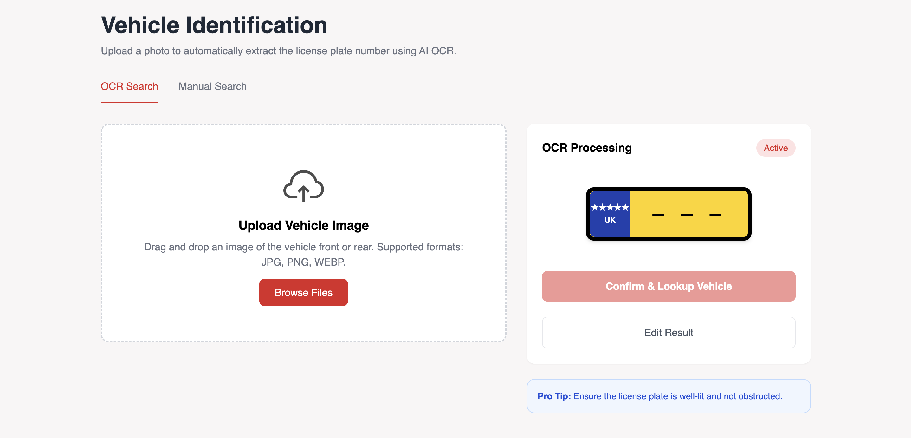
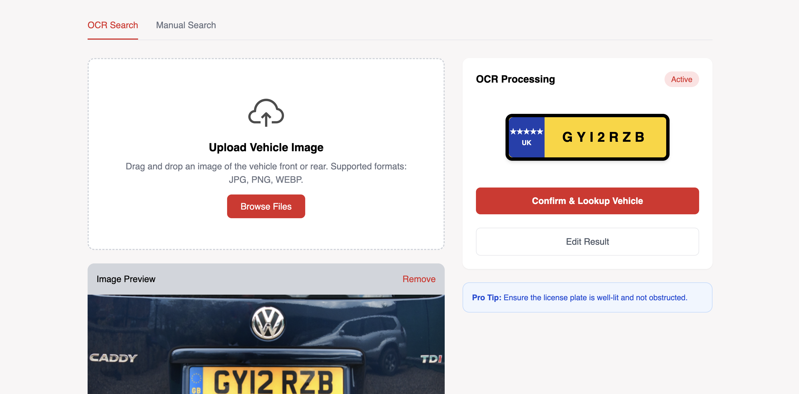
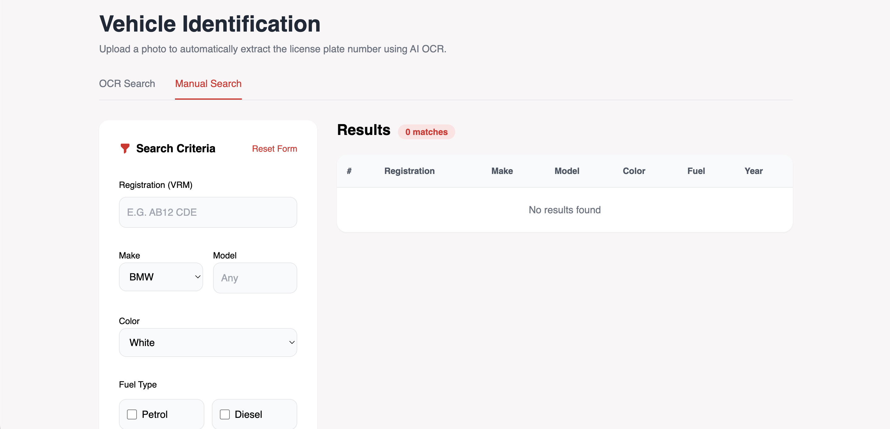

<div align="center">

# 🚗 Vehicle Lookup System

### Manual & OCR-Based Vehicle Search Web Application


</div>

---

## 📌 Overview

Vehicle Lookup System is a modern web application built with **React + TypeScript** that allows users to:

- 🔎 Search vehicles manually using registration data  
- 📸 Detect license plates using OCR image upload  
- 🚘 View detailed vehicle information  
- ⚡ Fetch real-time data from backend APIs  

---

## ✨ Features

✔ Manual vehicle search  
✔ OCR license plate recognition  
✔ Axios-based API integration  
✔ Environment variable configuration  
✔ Responsive modern UI  
✔ Clean and scalable project structure  

---

## 🛠 Tech Stack

| Technology | Purpose |
|------------|----------|
| React | Frontend Library |
| TypeScript | Type Safety |
| Vite | Build Tool |
| Axios | API Requests |
| Tailwind CSS | Styling |

---

## 📂 Project Structure

```
src/
 ├── api/
 │    ├── axiosInstance.ts
 │    ├── vehicleApi.ts
 │    └── apiOcr.ts
 │
 ├── pages/
 │    ├── ManualPage.tsx
 │    └── OcrPage.tsx
 │
 ├── components/
 ├── layout/
 └── main.tsx

docs/
 ├── 1.png   (OCR Page)
 ├── 2.png   (OCR Result)
 └── 3.png   (Manual Page)
```

---

## 📦 Installation

Clone the repository:

```bash
git clone <your-repository-url>
cd vehicle-lookup
```

Install dependencies:

```bash
npm install
```

Run development server:

```bash
npm run dev
```

---

## ⚙ Environment Variables

Create a `.env` file in the project root:

```
VITE_OCR_API_BASE=<your-ocr-api-base-url>
VITE_VEHICLE_API_BASE=<your-vehicle-api-base-url>
```

⚠️ Do not commit your `.env` file to GitHub.

---


# 📸 Application Screenshots

## 🔍 OCR Page

### Upload Screen


### OCR Result


---

## 🚘 Manual Search Page



---

## 🚀 Future Improvements

- Pagination support  
- Sorting & advanced filtering  
- Better loading states  
- Global error handling  
- Authentication support  
- Production deployment  

---

## 🧑‍💻 Author

Developed as part of an internship task.

---

<div align="center">

⭐ If you like this project, consider giving it a star!

</div>
